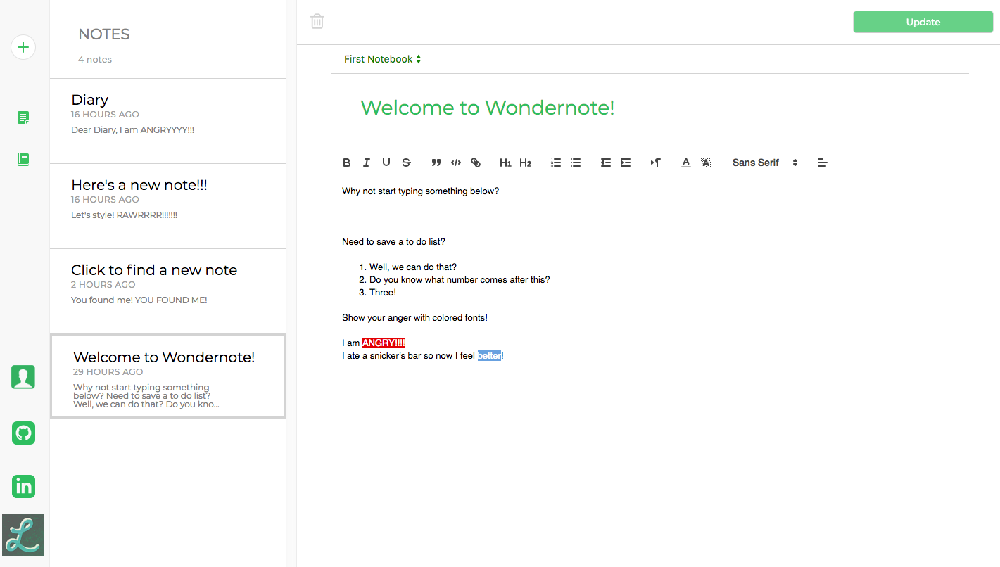
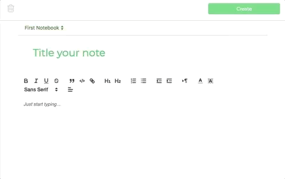

### README

# Summary

Wondernote is a single-page web application inspired by the cloud-storage app: Evernote, using Ruby on Rails, React, Redux, PostgreSQL, Quill and Webpack. The core functionality of this project was completed over two weeks (encompassing user, session, note and notebook functionality). Users are allowed to make an account, create notes that include rich-text editing, and sort their notebooks (notebooks consist of notes). Wondernote provides an elegant way to store all your information in the single page app by using drawers and sidebars to store information. Check it the [live demo](https://wondernote-aa.herokuapp.com/) and create your first note today!

# Features

* Secure user authentication
* Rich Text Editing Tool
* Notes and Notebooks CRUD
* Note can be organized and viewed through notebooks

# Implementation

* PostgreSQL: Stores all of the application information in the database (users, notes, notebooks)
* Quill: The rich-text editing tool that allows the user to change the layout of their notes
* Ruby on Rails: Web-application tool that follows the Model-View-Controller framework when handling requests made by the user
* Redux: The JS framework that helped maintain and organized the application state through the store, action creators and reducers
* React: The JS library that organizes the application based off of Components

# Future Implementation
* Search: Find their notes through a search bar
* Tags: Allow users to tag notes and find these notes by searching through the tags
* Pictures: Host pictures on the notes
* Live edit: Multiple users can edit the page at the same time

# Demonstration

View the [live demo](https://wondernote-aa.herokuapp.com/)
